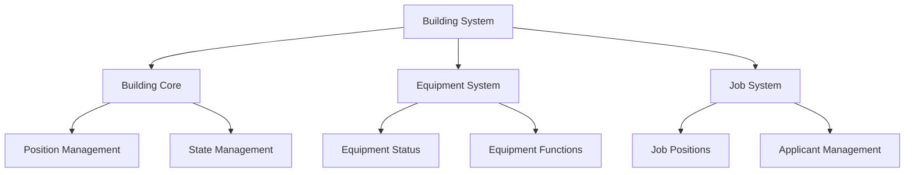

# Building System

The Building System manages all structures and locations within the simulation, handling building properties, equipment, jobs, and interactions with characters.

## Overview



## Core Components

### Building Model

The Building class inherits from SimsAgent, providing AI-powered interactions:

```python
class Building:
    def __init__(self, id, name, llm_cfg, xMin, yMin, xMax, yMax, 
                 description, instruction, equipments=None, 
                 jobs=None, money=0):
        self.guid = id
        self.name = name
        self.money = money
        self.position = (xMin, yMin, xMax, yMax)
        self.equipments = {}  # Equipment dictionary
        self.job_positions = {}  # Available jobs
```

### Position Management

Buildings occupy specific coordinates on the map:

```python
def cordinate_in_building(self, x, y):
    return (self.xMin <= x and x <= self.xMax and 
            self.yMin <= y and y <= self.yMax)

@property
def random_pos_inside(self):
    # Returns random valid position within building
    while True:
        x = random.randint(self.xMin, self.xMax)
        y = random.randint(self.yMin, self.yMax)
        if self.map[x][y] == 1:
            return (x, y)
```

## Equipment System

### Equipment Model

```python
class InBuildingEquip:
    def __init__(self, name, instruction, inbuilding=None, 
                 x=None, y=None, interactable=False, 
                 status=None, functions=None):
        self.name = name
        self.instruction = instruction
        self.status = status
        self.interactable = interactable
        self.functions = self._setup_functions(functions)
```

Key features:
- Equipment positioning within buildings
- Interactable status tracking
- Custom function registration
- Status management

## Job System

### Job Management

```python
class Job:
    def __init__(self, name, description, salary, 
                 inbuilding, num_positions):
        self.name = name
        self.description = description
        self.salary = salary
        self.inbuilding = inbuilding
        self.applicants = []
        self.num_positions = num_positions
```

Features:
- Position tracking
- Salary management
- Applicant handling
- Multiple position support

## Building Operations

### State Management

Buildings maintain various states and properties:

```python
# Core building operations
def modify_internal_properties(self, prop):
    for key, val in prop.items():
        if key in self.modifiable_status:
            setattr(prop, key, val)

def save_self_locally(self):
    # Saves building state to disk
    if self.save_dir:
        dict2save = find_instance_specific_data_attrs(self)
        # ... saving logic
```

### Equipment Operations

```python
def register_equip_functions(self, equipment):
    if equipment.functions:
        for func in equipment.functions:
            self.register_callable_tools(func)

def equipment_instr(self, equip_name):
    return f"{self.equipments[equip_name].instruction} Current status: {self.equipments[equip_name].organize_status()}"
```

## Building Collections

### BuildingList Management

```python
class BuildingList:
    def __init__(self):
        self.buildings = []
        
    def get_building_by_pos(self, x, y):
        for building in self.buildings:
            if building.cordinate_in_building(x, y):
                return building
        return None
```

## Best Practices

1. **Building Creation**
   - Always provide unique building IDs
   - Set proper coordinate boundaries
   - Include clear descriptions and instructions

2. **Equipment Management**
   - Register equipment functions properly
   - Maintain equipment status
   - Handle equipment interactions carefully

3. **Job Management**
   - Track position availability
   - Manage applicants properly
   - Update salary information

4. **State Persistence**
   - Regular state saves
   - Proper serialization
   - Version control for saved states

## API Reference

For detailed API documentation, see:
- [Building Model API](../api-reference/models/building.md)
- [Equipment API](../api-reference/models/equipment.md)
- [Job System API](../api-reference/models/job.md) 