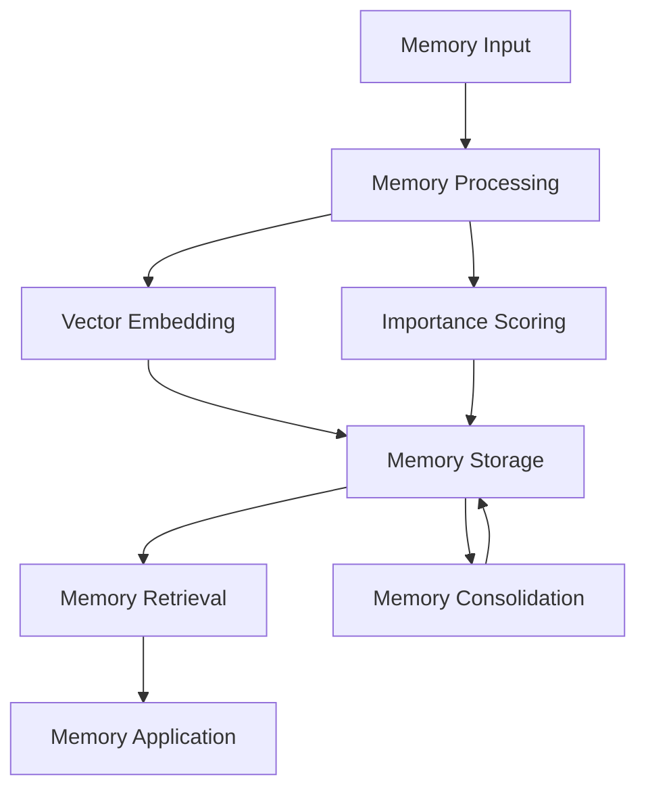

# Memory System

The Memory System is a sophisticated component that enables characters to store, retrieve, and utilize experiences and information in a human-like way. It uses vector embeddings and semantic search to create a realistic memory experience.

## Overview



## Core Components

### 1. Memory Model

```python
class Memory:
    def __init__(self, content, importance=0.5):
        self.content = content
        self.importance = importance
        self.timestamp = current_time()
        self.embedding = None
        self.related_entities = []
        self.emotions = {}
        self.context = {}
```

### 2. Memory Manager

```python
class MemoryManager:
    def __init__(self, character):
        self.character = character
        self.short_term_memory = []
        self.long_term_memory = []
        self.memory_index = None
        self.importance_threshold = 0.3
        
    def add_memory(self, memory):
        if memory.importance >= self.importance_threshold:
            self.process_and_store(memory)
            
    def retrieve_memories(self, query, limit=5):
        return self.semantic_search(query, limit)
```

## Memory Types

### 1. Short-term Memory

Temporary storage for recent experiences:
- High accessibility
- Limited capacity
- Temporary duration
- Frequent updates

```python
class ShortTermMemory:
    def __init__(self, capacity=100):
        self.memories = []
        self.capacity = capacity
    
    def add(self, memory):
        if len(self.memories) >= self.capacity:
            self.consolidate_memories()
        self.memories.append(memory)
```

### 2. Long-term Memory

Permanent storage for important information:
- Persistent storage
- Unlimited capacity
- Organized structure
- Importance-based retention

```python
class LongTermMemory:
    def __init__(self):
        self.memories = {}
        self.indexes = {}
    
    def store(self, memory):
        vector = self.embed_memory(memory)
        self.memories[memory.id] = memory
        self.indexes[memory.id] = vector
```

## Memory Processing

### 1. Memory Creation

```python
def create_memory(content, context):
    memory = Memory(content)
    memory.importance = calculate_importance(content, context)
    memory.embedding = generate_embedding(content)
    memory.context = extract_context(context)
    return memory

# Example usage
memory = create_memory(
    content="Met Sarah at the cafe",
    context={
        "location": "Town Cafe",
        "time": "morning",
        "emotion": "happy"
    }
)
```

### 2. Importance Scoring

```python
def calculate_importance(content, context, factors):
    score = 0.0
    
    # Content-based scoring
    score += analyze_content_significance(content)
    
    # Context-based scoring
    score += evaluate_context_importance(context)
    
    # Emotional impact
    score += measure_emotional_impact(factors.get('emotion'))
    
    return normalize_score(score)
```

## Memory Storage

### 1. Vector Database Integration

```python
class VectorStorage:
    def __init__(self):
        self.milvus_client = MilvusClient()
        self.collection = None
        
    def store_vector(self, memory_id, vector):
        return self.milvus_client.insert(
            collection_name="memories",
            vectors=[vector],
            ids=[memory_id]
        )
```

### 2. Memory Indexing

```python
class MemoryIndex:
    def __init__(self):
        self.index = {}
        self.reverse_index = {}
        
    def add_memory(self, memory):
        # Index by time
        self.index_by_time(memory)
        
        # Index by entities
        self.index_by_entities(memory)
        
        # Index by emotions
        self.index_by_emotions(memory)
```

## Memory Retrieval

### 1. Semantic Search

```python
def semantic_search(query, memories, limit=5):
    # Generate query embedding
    query_vector = generate_embedding(query)
    
    # Search in vector space
    results = vector_storage.search(
        collection_name="memories",
        query_vectors=[query_vector],
        limit=limit
    )
    
    return process_search_results(results)
```

### 2. Context-based Retrieval

```python
def retrieve_by_context(context, limit=5):
    relevant_memories = []
    
    # Filter by location
    if 'location' in context:
        location_memories = find_memories_by_location(
            context['location']
        )
        relevant_memories.extend(location_memories)
    
    # Filter by time
    if 'time' in context:
        time_memories = find_memories_by_time(
            context['time']
        )
        relevant_memories.extend(time_memories)
    
    return rank_and_limit(relevant_memories, limit)
```

## Memory Application

### 1. Decision Making

```python
def make_decision(situation, options):
    # Retrieve relevant memories
    memories = retrieve_relevant_memories(situation)
    
    # Analyze past experiences
    experiences = analyze_memories(memories)
    
    # Apply memory-based reasoning
    decision = reason_from_experiences(
        experiences,
        options
    )
    
    return decision
```

### 2. Conversation Context

```python
def get_conversation_context(target, topic):
    # Get relevant memories about target
    target_memories = retrieve_memories_about(target)
    
    # Get topic-related memories
    topic_memories = retrieve_memories_about(topic)
    
    # Combine and process memories
    context = create_conversation_context(
        target_memories,
        topic_memories
    )
    
    return context
```

## Memory Maintenance

### 1. Memory Consolidation

```python
def consolidate_memories():
    # Get short-term memories
    recent_memories = get_short_term_memories()
    
    # Group related memories
    memory_groups = group_related_memories(recent_memories)
    
    # Create consolidated memories
    for group in memory_groups:
        consolidated = create_consolidated_memory(group)
        store_in_long_term_memory(consolidated)
```

### 2. Memory Decay

```python
def apply_memory_decay():
    for memory in all_memories:
        # Calculate time factor
        age = current_time() - memory.timestamp
        decay_factor = calculate_decay_factor(age)
        
        # Update importance
        memory.importance *= decay_factor
        
        # Archive or remove if below threshold
        if memory.importance < min_importance:
            archive_memory(memory)
```

## Integration Examples

### 1. Basic Memory Usage

```python
# Adding a memory
character.add_memory(
    content="Had coffee with Bob",
    importance=0.7,
    context={
        "location": "Cafe",
        "time": "morning",
        "emotion": "happy"
    }
)

# Retrieving memories
memories = character.retrieve_memories(
    query="What do I know about Bob?",
    limit=5
)
```

### 2. Memory-based Interaction

```python
def handle_interaction(target, context):
    # Get relevant memories
    memories = retrieve_memories_about(target)
    
    # Process memories for context
    interaction_context = process_memories_for_interaction(
        memories,
        context
    )
    
    # Generate response
    response = generate_response_with_context(
        interaction_context
    )
    
    return response
```

## Best Practices

1. **Memory Creation**
   - Include relevant context
   - Set appropriate importance
   - Add emotional content
   - Tag related entities

2. **Memory Retrieval**
   - Use specific queries
   - Consider context
   - Limit result size
   - Handle missing memories

3. **Memory Maintenance**
   - Regular consolidation
   - Proper decay rules
   - Importance thresholds
   - Backup strategies

## API Reference

For detailed API documentation, see:
- [Memory Model API](../api-reference/models/memory.md)
- [Memory Manager API](../api-reference/services/memory-manager.md)
- [Vector Storage API](../api-reference/services/vector-storage.md) 