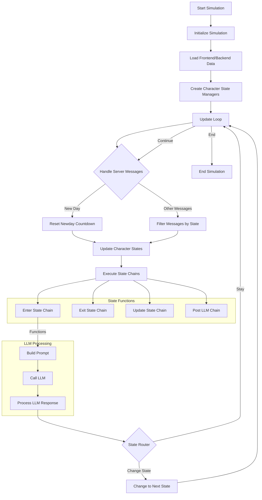
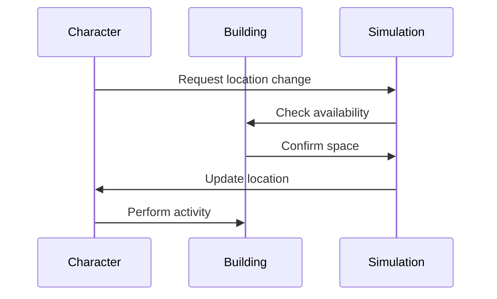
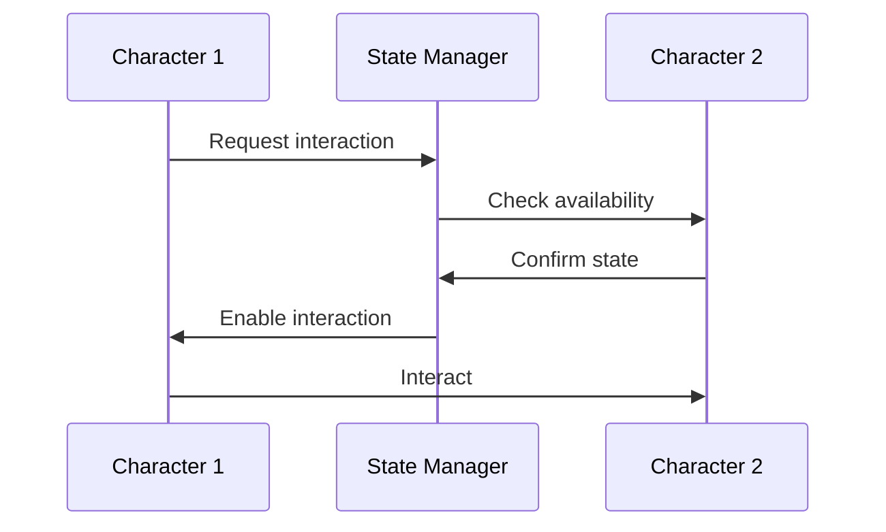
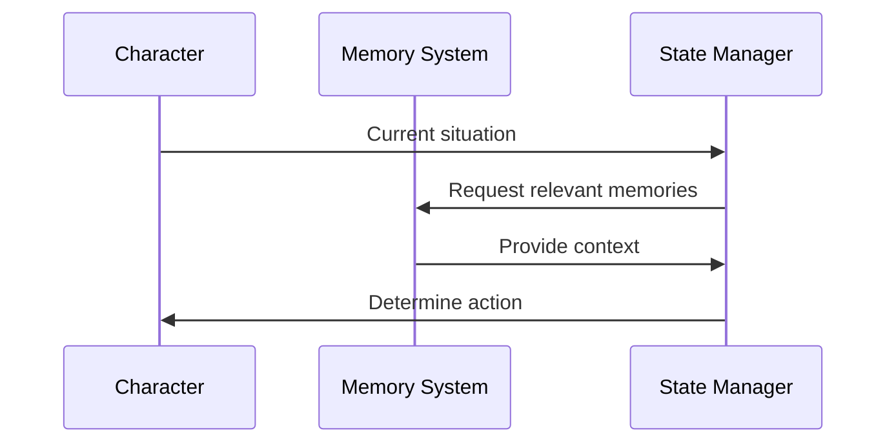

# Core Concepts Overview

The Degent Civil is built around several key concepts that work together to create a dynamic and interactive virtual town environment. This overview will introduce you to these core concepts and how they interact with each other.

## System Architecture

## Key Components

### 1. Simulation

The Simulation is the main container and orchestrator of the simulation. It:
- Manages all characters and buildings
- Coordinates events and interactions
- Maintains the simulation state
- Handles time progression
- Manages global resources

### 2. Characters

Characters are the intelligent agents within the simulation. They:
- Have personalities and traits
- Maintain relationships with other characters
- Follow daily routines and schedules
- Interact with other characters and buildings
- Store and retrieve memories
- Change states based on activities

### 3. Buildings

Buildings are locations within the simulation where:
- Characters can be located
- Activities take place
- Events can be hosted
- Resources can be stored
- Services can be provided

### 4. State Management

The state system:
- Controls character behavior
- Manages transitions between activities
- Handles interruptions and priorities
- Ensures realistic behavior patterns
- Coordinates multi-character interactions

### 5. Memory System

The memory system allows characters to:
- Store experiences and information
- Retrieve relevant memories
- Influence decision making
- Build relationships over time
- Learn from past interactions

## Component Interactions

### Character-Building Interaction

### Character-Character Interaction

### Memory-State Interaction

## System Flow

1. **Initialization**
   - Town creation
   - Character and building setup
   - State system initialization
   - Memory system preparation

2. **Runtime**
   - Time progression
   - State updates
   - Interaction processing
   - Memory management
   - Event handling

3. **Interaction Processing**
   - State checking
   - Memory retrieval
   - Action determination
   - Response generation
   - Memory storage

## Integration Points

### 1. LLM Integration

The system integrates with Large Language Models for:
- Natural language processing
- Decision making
- Response generation
- Memory summarization
- Personality expression

### 2. Database Integration

Persistent storage is used for:
- Character data
- Memory vectors
- Relationship graphs
- State history
- Event logs

### 3. External Services

The system can connect with:
- WebSocket for real-time updates
- Redis for caching
- Milvus for vector search
- Custom APIs for extended functionality

## Next Steps

- Learn more about the [Character System](character-system.md)
- Explore [State Management](state-management.md)
- Understand the [Memory System](memory-system.md)
- Study the [Building System](building-system.md)
- Dive into [Simulation Logic](simulation-logic.md) 