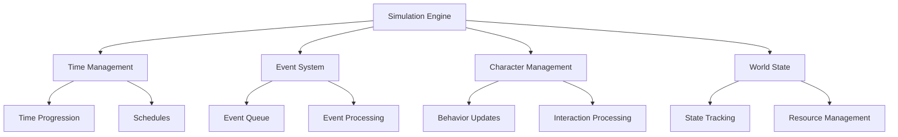

# Simulation Logic

The Simulation Logic system is the core engine that drives the Degent Civilization. It manages time progression, event scheduling, character behaviors, and the overall simulation state.

## Overview



## Core Components

### 1. Simulation Engine

```python
class SimulationEngine:
    def __init__(self):
        self.time_manager = TimeManager()
        self.event_system = EventSystem()
        self.character_manager = CharacterManager()
        self.world_state = WorldState()
        self.is_running = False
        
    def start_simulation(self):
        self.is_running = True
        self.main_loop()
        
    def main_loop(self):
        while self.is_running:
            self.update()
            self.process_events()
            self.update_characters()
            self.time_manager.advance_time()
```

### 2. Time Management

```python
class TimeManager:
    def __init__(self):
        self.current_time = 0
        self.time_scale = 1.0
        self.tick_rate = 60
        
    def advance_time(self):
        delta = 1.0 / self.tick_rate * self.time_scale
        self.current_time += delta
        self.update_scheduled_events()
        
    def set_time_scale(self, scale):
        self.time_scale = max(0.1, min(10.0, scale))
```

## Event System

### 1. Event Queue

```python
class EventQueue:
    def __init__(self):
        self.events = []
        self.processed_events = []
        
    def add_event(self, event):
        heapq.heappush(self.events, (event.time, event))
        
    def process_next_event(self):
        if self.events:
            time, event = heapq.heappop(self.events)
            if time <= current_time():
                self.process_event(event)
```

### 2. Event Types

```python
class SimulationEvent:
    def __init__(self, event_type, time, data):
        self.type = event_type
        self.time = time
        self.data = data
        self.processed = False
        
    def process(self):
        if self.type == "CHARACTER_INTERACTION":
            self.process_character_interaction()
        elif self.type == "SCHEDULED_EVENT":
            self.process_scheduled_event()
```

## Character Management

### 1. Behavior Processing

```python
class BehaviorProcessor:
    def update_characters(self, characters):
        for character in characters:
            self.process_character_behavior(character)
            
    def process_character_behavior(self, character):
        # Update state
        character.update_state()
        
        # Process needs
        character.process_needs()
        
        # Handle interactions
        character.process_interactions()
        
        # Update location
        character.update_location()
```

### 2. Interaction System

```python
class InteractionSystem:
    def process_interaction(self, source, target, type):
        if self.can_interact(source, target):
            interaction = self.create_interaction(
                source, target, type
            )
            return self.execute_interaction(interaction)
        return False
```

## World State Management

### 1. State Tracking

```python
class WorldState:
    def __init__(self):
        self.characters = {}
        self.buildings = {}
        self.events = {}
        self.resources = {}
        
    def update(self):
        self.update_characters()
        self.update_buildings()
        self.update_resources()
        self.check_event_triggers()
```

### 2. Resource Management

```python
class ResourceManager:
    def __init__(self):
        self.resources = {}
        self.consumers = {}
        self.producers = {}
        
    def update_resources(self):
        self.process_production()
        self.process_consumption()
        self.balance_resources()
```

## Time-Based Features

### 1. Schedule Management

```python
class ScheduleManager:
    def __init__(self):
        self.schedules = {}
        self.active_tasks = {}
        
    def add_schedule(self, entity, schedule):
        self.schedules[entity.id] = schedule
        
    def update_schedules(self):
        current_time = self.get_current_time()
        for entity_id, schedule in self.schedules.items():
            self.process_schedule(entity_id, schedule, current_time)
```

### 2. Time-Based Events

```python
class TimeBasedEvent:
    def __init__(self, trigger_time, event_type, data):
        self.trigger_time = trigger_time
        self.event_type = event_type
        self.data = data
        self.recurring = False
        
    def should_trigger(self, current_time):
        return current_time >= self.trigger_time
```

## Integration Examples

### 1. Basic Simulation Setup

```python
# Initialize simulation
simulation = SimulationEngine()

# Add characters
simulation.add_character(
    Character("Alice", "Shop Owner")
)
simulation.add_character(
    Character("Bob", "Customer")
)

# Add buildings
simulation.add_building(
    Building("Shop", "Commercial")
)

# Start simulation
simulation.start()
```

### 2. Event Handling

```python
# Creating and processing events
def handle_character_meeting():
    event = SimulationEvent(
        event_type="CHARACTER_MEETING",
        time=current_time() + 3600,
        data={
            "characters": ["Alice", "Bob"],
            "location": "Shop",
            "duration": 1800
        }
    )
    simulation.event_system.add_event(event)
```

## Advanced Features

### 1. Simulation Controls

```python
class SimulationControls:
    def pause_simulation(self):
        self.is_running = False
        self.save_state()
        
    def resume_simulation(self):
        self.load_state()
        self.is_running = True
        
    def set_simulation_speed(self, speed):
        self.time_manager.set_time_scale(speed)
```

### 2. State Persistence

```python
class StatePersistence:
    def save_state(self):
        state = {
            'time': self.current_time,
            'characters': self.serialize_characters(),
            'buildings': self.serialize_buildings(),
            'events': self.serialize_events()
        }
        return self.store_state(state)
        
    def load_state(self, state_id):
        state = self.retrieve_state(state_id)
        self.restore_simulation(state)
```

## Performance Optimization

### 1. Update Scheduling

```python
class UpdateScheduler:
    def __init__(self):
        self.update_frequency = {
            'characters': 1,    # Every tick
            'buildings': 5,     # Every 5 ticks
            'resources': 10,    # Every 10 ticks
            'events': 1         # Every tick
        }
        
    def should_update(self, component, tick):
        return tick % self.update_frequency[component] == 0
```

### 2. Spatial Partitioning

```python
class SpatialManager:
    def __init__(self, world_size, partition_size):
        self.partitions = {}
        self.setup_partitions(world_size, partition_size)
        
    def update_entity_position(self, entity):
        old_partition = self.get_entity_partition(entity)
        new_partition = self.calculate_partition(entity.position)
        self.move_entity(entity, old_partition, new_partition)
```

## Best Practices

1. **Simulation Management**
   - Regular state saves
   - Performance monitoring
   - Error handling
   - Load balancing

2. **Event Processing**
   - Priority handling
   - Event validation
   - Error recovery
   - Event logging

3. **Time Management**
   - Consistent time steps
   - Time scale limits
   - Schedule validation
   - Time synchronization

## Common Issues and Solutions

### 1. Performance Issues

Problem: Simulation slowdown
Solution:
```python
def optimize_performance():
    # Implement spatial partitioning
    spatial_manager = SpatialManager(world_size, partition_size)
    
    # Use update scheduling
    update_scheduler = UpdateScheduler()
    
    # Batch processing
    batch_processor = BatchProcessor(batch_size=100)
```

### 2. State Consistency

Problem: Inconsistent simulation state
Solution:
```python
def maintain_state_consistency():
    # Regular state validation
    state_validator = StateValidator()
    
    # Automatic state correction
    state_corrector = StateCorrector()
    
    # State logging
    state_logger = StateLogger()
```

## API Reference

For detailed API documentation, see:
- [Simulation Engine API](../api-reference/services/simulation.md)
- [Event System API](../api-reference/services/event-system.md)
- [Time Management API](../api-reference/services/time-manager.md) 