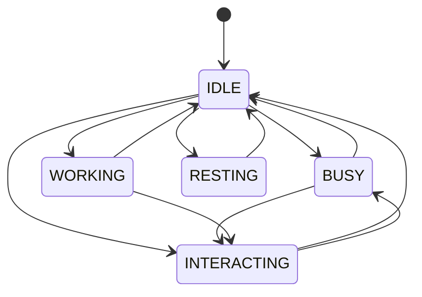

# State Management

The State Management system is a crucial component of the Degent Civilization that controls character behaviors, activities, and interactions through a sophisticated state machine implementation.

## Overview



## State Types

### 1. Base States

```python
from enum import Enum

class CharacterState(Enum):
    IDLE = auto()
    MOVE = auto()
    SLEEPING = auto()
    PLAN = auto()
    ACT = auto()
    PERSP = auto()
    PERSPQ = auto()
    PERSPA = auto()
    CRITIC = auto()
    CHATINIT = auto()
    CHATING = auto()
    ACTREFLECTION = auto()
```

### 2. Composite States

States can be combined with modifiers:
- Primary state: Main activity
- Secondary state: Additional context
- Temporary state: Short-term condition

```python
character.set_composite_state(
    primary="WORKING",
    secondary="INTERACTING",
    temporary="STRESSED"
)
```

## State Manager

### 1. Basic Operations

```python
class StateManager:
    def __init__(self, character):
        self.character = character
        self.current_state = None
        self.state_history = []
        self.state_transitions = {}
        
    def change_state(self, new_state):
        if self.can_transition_to(new_state):
            self.exit_current_state()
            self.enter_new_state(new_state)
            
    def can_transition_to(self, new_state):
        return new_state in self.state_transitions.get(
            self.current_state, []
        )
```

### 2. State Lifecycle

Each state has three main phases:
1. **Enter**: Initial setup and validation
2. **Update**: Regular state maintenance
3. **Exit**: Cleanup and transition preparation

```python
class BaseState:
    def enter_state(self):
        """Called when entering the state"""
        pass
        
    def update_state(self):
        """Called every update cycle"""
        pass
        
    def exit_state(self):
        """Called when exiting the state"""
        pass
```

## State Implementation

### 1. Idle State

```python
class IdleState(BaseState):
    def enter_state(self):
        self.character.reset_activity()
        self.character.look_for_activities()
    
    def update_state(self):
        if self.character.has_pending_activities():
            self.change_state("BUSY")
    
    def exit_state(self):
        self.character.prepare_for_activity()
```

### 2. Working State

```python
class WorkingState(BaseState):
    def enter_state(self):
        self.character.start_work_routine()
        self.set_work_schedule()
    
    def update_state(self):
        self.character.perform_work_tasks()
        if self.is_work_complete():
            self.change_state("IDLE")
    
    def exit_state(self):
        self.character.complete_work_tasks()
```

## State Transitions

### 1. Transition Rules

```python
class StateTransitionRules:
    def __init__(self):
        self.transitions = {
            "IDLE": ["BUSY", "INTERACTING", "WORKING", "RESTING"],
            "BUSY": ["IDLE", "INTERACTING"],
            "WORKING": ["IDLE", "INTERACTING"],
            "INTERACTING": ["IDLE", "BUSY", "WORKING"],
            "RESTING": ["IDLE"]
        }
    
    def can_transition(self, from_state, to_state):
        return to_state in self.transitions.get(from_state, [])
```

### 2. Transition Conditions

```python
class TransitionCondition:
    def __init__(self, from_state, to_state, conditions):
        self.from_state = from_state
        self.to_state = to_state
        self.conditions = conditions
    
    def check_conditions(self, character):
        return all(
            condition(character) 
            for condition in self.conditions
        )
```

## State Behaviors

### 1. Activity Management

```python
class StateBehavior:
    def handle_interaction(self, target):
        if self.can_interact():
            return self.start_interaction(target)
        return False
    
    def handle_interruption(self, priority):
        if self.can_be_interrupted(priority):
            self.pause_current_activity()
            return True
        return False
```

### 2. Time Management

```python
class TimeAwareState:
    def __init__(self, duration=None):
        self.start_time = None
        self.duration = duration
    
    def is_expired(self):
        if not self.duration:
            return False
        return (current_time() - self.start_time) >= self.duration
```

## Integration Examples

### 1. Basic State Change

```python
# Simple state transition
character.change_state("WORKING")

# Conditional state change
if character.is_tired():
    character.change_state("RESTING")
```

### 2. Complex State Management

```python
# Managing work schedule
character.state_manager.schedule_state_change(
    new_state="WORKING",
    start_time="09:00",
    duration=480  # 8 hours
)

# Handling interruptions
character.state_manager.handle_interruption(
    new_state="INTERACTING",
    priority="HIGH",
    duration=15
)
```

### 3. State-based Behavior

```python
# State-specific actions
if character.current_state == "WORKING":
    character.perform_work_tasks()
elif character.current_state == "RESTING":
    character.recover_energy()
```

## Advanced Features

### 1. State Priorities

States can have different priority levels:
- CRITICAL: Must be handled immediately
- HIGH: Important but can wait
- NORMAL: Regular activities
- LOW: Can be interrupted

### 2. State Queuing

```python
class StateQueue:
    def add_state(self, state, priority):
        self.queue.put((priority, state))
    
    def process_next_state(self):
        if not self.queue.empty():
            priority, state = self.queue.get()
            self.change_state(state)
```

### 3. State History

```python
class StateHistory:
    def add_state_change(self, from_state, to_state):
        self.history.append({
            'from': from_state,
            'to': to_state,
            'time': current_time()
        })
    
    def get_recent_states(self, limit=5):
        return self.history[-limit:]
```

## Best Practices

1. **State Validation**
   - Always check if state transition is valid
   - Validate state conditions before changing
   - Handle invalid state transitions gracefully

2. **State Duration**
   - Set appropriate timeouts for states
   - Handle state expiration properly
   - Consider state interruptions

3. **State Cleanup**
   - Always cleanup resources in exit_state
   - Handle incomplete activities
   - Update character status properly

## Common Issues and Solutions

### 1. State Lock

Problem: Character stuck in a state
Solution:
```python
def force_state_reset(character):
    character.exit_current_state(force=True)
    character.change_state("IDLE")
```

### 2. Invalid Transitions

Problem: Illegal state transitions
Solution:
```python
def safe_state_change(character, new_state):
    if character.can_transition_to(new_state):
        character.change_state(new_state)
    else:
        character.queue_state_change(new_state)
```

## API Reference

For detailed API documentation, see:
- [State Manager API](../api-reference/services/character-state.md)
- [State Implementation](../api-reference/services/state-implementation.md)
- [Transition Rules](../api-reference/services/transition-rules.md)

## Related Guides
- [How to Add a New State](../examples/add_new_state.md) 